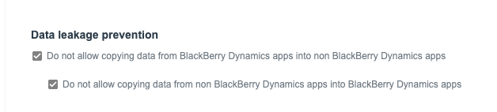

# BlackBerry Dynamics Sample App for iOS - Swift

This sample pairs with Basic-iOS-Swift as examples of iOS apps before and after integrating with the BlackBerry Dynamics SDK. The two samples demostrate features commonly used in the BlackBerry Dynamics applications; secure file storage, secure database (SQL and CoreData), secure communication (HTTP/S and Socket) and a Data Loss Prevention Share View example.

## Requirements

See [Software Requirements](https://docs.blackberry.com/en/development-tools/blackberry-dynamics-sdk-ios/current/blackberry-dynamics-sdk-ios-devguide/gwj1489687014271/vcw1490294551674) of the BlackBerry Dynamics SDK (iOS) 

## How To Build and Deploy

1. Set up BlackBerry Dynamics Development Environment.
2. Clone the repo. 
3. Run `pod install` to create project workspace.
4. Launch Xcode and open the project.
5. Edit the *Bundle Identifier* to your own. 
6. Edit the *URL identifier* and *URL Schemes* according to your own in the *info.plist*. See [Declaring a URL type to support BlackBerry Dynamics features](https://docs.blackberry.com/en/development-tools/blackberry-dynamics-sdk-ios/current/blackberry-dynamics-sdk-ios-devguide/gwj1489687014271/rhn1489778136320)
7. Edit the *GDApplicationID* to your own in the *info.plist*.  
8. Add *BlackBerry Dynamics App entitlement* and *BlackBerry Dynamics entitlment version* to your UEM server. See [Add an internal BlackBerry Dynamics app entitlement](https://docs.blackberry.com/en/endpoint-management/blackberry-uem/current/administration/blackberry-dynamics/Adding-Dynamics-apps/zjx1471960344735) 
9. Assign the app entitlement to a user in your UEM server. 
10. Build, deploy and run on a testing device.

For more information on how to develop BlackBerry Dynamics apps, refer to [Get Started with BlackBerry Dynamics](https://developers.blackberry.com/us/en/resources/get-started/blackberry-dynamics-getting-started) 

## How to test Share Sheet DLP Example

 `ShareViewController.swift`  is updated by `AppDelegate.swift` when changes to the users/app Dynamics Policy Configuration occur. 
 When `GDAppConfigKeyPreventDataLeakageIn` is `true`, the application cannot import data from other applications or services. 
 When `GDAppConfigKeyPreventDataLeakageOut` is `true`, the application cannot share data to other applications. 
 _[Documentation](https://developer.blackberry.com/devzone/files/blackberry-dynamics/ios/interface_g_di_o_s.html#a3265c6148406a8850ba673b26e472ece)_
 
 You can test this functionality by creating a `BlackBerry Dynamics Profile` under `Policies and Pofiles` in your UEM Console. Configure two profiles. One profile can be named as `Enabled DLP`, and the other,`Disable DLP`. 
 
 

 You can assign different DLP settings to a test user after the application is activated. When the DLP setting is applied, you can navigate to the `ShareViewController.swift` on your app, and attempt to share under both cases. 

 
 ## Author(s)

* [EunKyung Choi](http://www.twitter.com/echotown)
* [Matthew Falkner](https://www.linkedin.com/in/matthewfalkner/)

## License

Apache 2.0 License

## Disclaimer

THE SOFTWARE IS PROVIDED "AS IS", WITHOUT WARRANTY OF ANY KIND, EXPRESS OR IMPLIED, INCLUDING BUT NOT LIMITED TO THE WARRANTIES OF MERCHANTABILITY, FITNESS FOR A PARTICULAR PURPOSE AND NONINFRINGEMENT. IN NO EVENT SHALL THE AUTHORS OR COPYRIGHT HOLDERS BE LIABLE FOR ANY CLAIM, DAMAGES OR OTHER LIABILITY, WHETHER IN AN ACTION OF CONTRACT, TORT OR OTHERWISE, ARISING FROM, OUT OF OR IN CONNECTION WITH THE SOFTWARE OR THE USE OR OTHER DEALINGS IN THE SOFTWARE.
